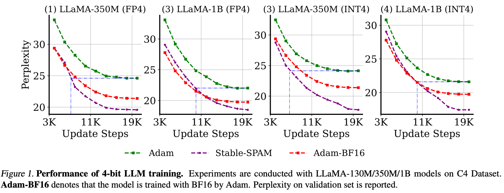
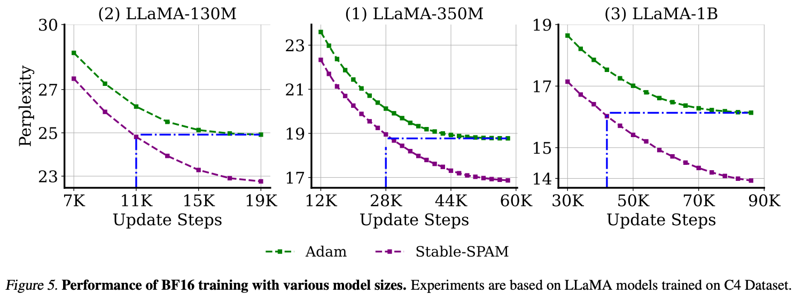
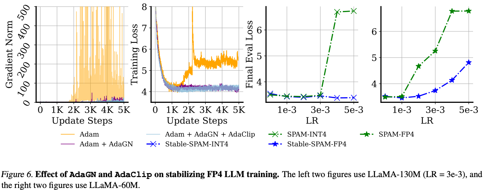
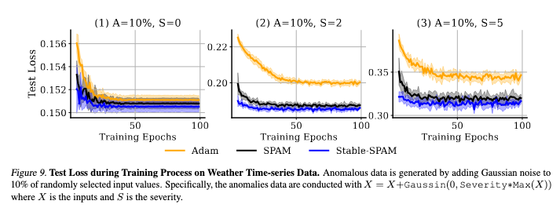

# Stable-SPAM Optimizer
This repo contains the pre-release version of StableSPAM optimizer, proposed by [Stable-SPAM: How to Train in 4-Bit More Stably than 16-Bit Adam](https://arxiv.org/pdf/2502.17055?)

we propose Stable-SPAM, which incorporates enhanced gradient normalization and clipping techniques.

<div align="center">
  
</div>
<div align="center">
  
</div>
<div align="center">
  
</div>
<div align="center">
  
</div>


## Abstract

This paper comprehensively evaluates several recently proposed optimizers for 4-bit training, revealing that low-bit precision amplifies sensitivity to learning rates and often causes unstable gradient norms, leading to divergence at higher learning rates. Among these, SPAM, a recent optimizer featuring momentum reset and spike-aware gradient clipping, achieves the best performance across various bit levels, but struggles to stabilize gradient norms, requiring careful learning rate tuning. To address these limitations, we propose **Stable-SPAM**, which incorporates enhanced gradient normalization and clipping techniques. In particular, **Stable-SPAM** (1) adaptively updates the clipping threshold for spiked gradients by tracking their historical maxima; $(2)$ normalizes the entire gradient matrix based on its historical l_2-norm statistics; and (3) inherits momentum reset from SPAM to periodically reset the first and second moments of Adam, mitigating the accumulation of spiked gradients. Extensive experiments show that **Stable-SPAM** effectively stabilizes gradient norms in 4-bit LLM training, delivering superior performance compared to Adam and SPAM. Notably, our 4-bit LLaMA-1B model trained with **Stable-SPAM** outperforms the BF16 LLaMA-1B trained with Adam by up to $2$ perplexity. Furthermore, when both models are trained in 4-bit, \texttt{Stable-SPAM} achieves the same loss as Adam while requiring only about half the training steps.

### TODO

- [x] Release LLM pre-training codes.
- [x] Release 4-Bit LLM training codes.
- [ ] Release Time Series Forescasting training codes.

## Quick Start

### Setup
Our repository is built on top of [GaLore](https://github.com/jiaweizzhao/GaLore). You can configure the environment using the following command lines:
conda create -n stablespam python=3.11 -y <br>
conda activate stablespam<br>
pip3 install torch torchvision torchaudio<br>
pip install transformers==4.31.0<br>
pip install tqdm wandb<br>
## Usage

```python
from galore_torch import StableSPAM

optimizer = StableSPAM(model.parameters(), lr=0.001,gamma1=0.7,gamma2=0.9,gamma3=0.999,total_T=20000,update_proj_gap=1000)
```
> \[!Note\]
>
> total_T:  is set to the total number of update steps. It will lead to a better LLM training but may not be necessary for other tasks.

### example: FP4 Training LLaMA-350M  
```

torchrun --standalone --nproc_per_node 4 main_pretrain.py \
    --model_config configs/llama_350m.json \
    --eval_every 1000 \
    --save_every 100000 \
    --dtype bfloat16 \
    --batch_size 128 \
    --total_batch_size 512 \
    --lr 0.0004 \
    --warmup_steps 2000 \
    --num_training_steps 20000 \
    --optimizer stablespam \
    --weight_quant \
    --simulation \
    --weight_group_size 256 \
    --weight_decay 0 \
    --project stablespam \
    --name stablespam_350_fp4_500_0.9_0.7_4e-4 \
    --save_dir saved \
    --restore_optimizer \
    --fp4 \
    --gamma1 0.7 \
    --gamma2 0.9 \
    --gamma3 0.999 \
    --update_proj_gap 500 
```

### example: INT4 Training LLaMA-350M 
```
torchrun --standalone --nproc_per_node 4 main_pretrain.py \
    --model_config configs/llama_350m.json \
    --eval_every 1000 \
    --save_every 100000 \
    --dtype bfloat16 \
    --batch_size 128 \
    --total_batch_size 512 \
    --lr 0.0004 \
    --warmup_steps 2000 \
    --num_training_steps 20000 \
    --optimizer stablespam \
    --weight_quant \
    --simulation \
    --weight_group_size 256 \
    --weight_bits 4 \
    --weight_decay 0 \
    --project stablespam \
    --name 350-stablespam-int4_0.9_0.7_0.999_4e-4 \
    --save_dir saved \
    --restore_optimizer \
    --act_quant \
    --act_group_size 64 \
    --act_stochastic \
    --gamma1 0.7 \
    --gamma2 0.9 \
    --gamma3 0.999 \
    --update_proj_gap 500 
```

### example: BF16 Training LLaMA-130M 
```
torchrun --standalone --nproc_per_node 4 main_pretrain.py \
    --model_config configs/llama_130m.json \
    --eval_every 1000 \
    --save_every 100000 \
    --dtype bfloat16 \
    --batch_size 128 \
    --total_batch_size 512 \
    --lr 0.0008 \
    --warmup_steps 2000 \
    --num_training_steps 20000 \
    --optimizer stablespam \
    --weight_decay 0 \
    --project stablespam \
    --name stablespam_350_fp4_500_0.9_0.7_4e-4 \
    --save_dir /scratch-shared/saved \
    --restore_optimizer \
    --gamma1 0.85 \
    --gamma2 0.99999 \
    --gamma3 0.999 \
    --update_proj_gap 1000 
```

## Acknowledgement
This repository is build upon the  [GaLore](https://github.com/jiaweizzhao/GaLore) repository. Thanks for the great work!
